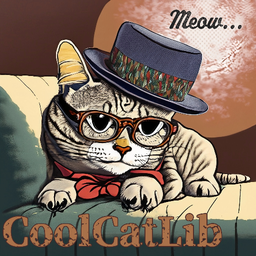
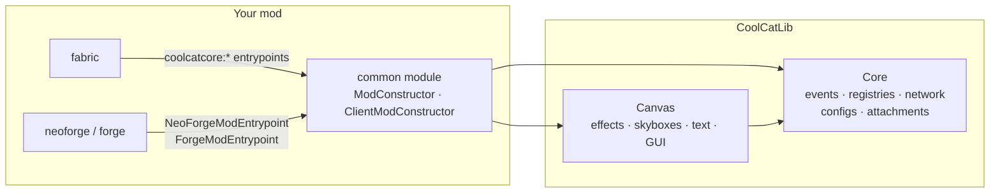

<div class="ccl-hero" markdown>

<div class="ccl-hero__logos">
  
</div>

# CoolCatLib { .ccl-hero__title }

<p class="ccl-hero__tagline">Write it once, run it everywhere, and make it look <em>purr-fect</em>.</p>

<p class="ccl-hero__lead">The foundation and the visuals for multi-loader Minecraft mods: one common codebase for Fabric, NeoForge and Forge, with no Architectury API needed.</p>

[Get started :material-arrow-right:](getting-started.md){ .md-button .md-button--primary }
[API reference](reference/api.md){ .md-button }
[:fontawesome-brands-github: Source](https://github.com/ixDarkLorD/CoolCatLib){ .md-button }

<p class="ccl-hero__badges">
  
  
</p>

<p class="ccl-hero__badges ccl-hero__badges--downloads">
  <a href="https://www.curseforge.com/minecraft/mc-mods/coolcatlib"></a>
  <a href="https://www.curseforge.com/minecraft/mc-mods/coolcatlib-canvas"></a>
  <a href="https://modrinth.com/mod/ASkaoGC8"></a>
  <a href="https://modrinth.com/mod/NtytwOvv"></a>
</p>

</div>

## Two mods, one toolkit

<div class="grid cards" markdown>

-   :material-toolbox-outline:{ .lg .middle } **CoolCatLib: Core**

    ---

    `coolcatcore` · the purr-fect foundation. Entrypoints that replace per-loader setup; events, registration and networking; synced TOML configs; attachments; containers and storage menus; item decorators.

    [:octicons-arrow-right-24: Getting started](getting-started.md)

-   :material-palette-outline:{ .lg .middle } **CoolCatLib: Canvas**

    ---

    `coolcatcanvas` · the cat's whiskers of visuals, built on Core. Live post-processing shaders, layered skyboxes, gradient and rainbow text, outlines, panels, pan & zoom views and easing curves.

    [:octicons-arrow-right-24: Screen effects](canvas/screen-effects.md)

</div>

## Why CoolCatLib

<div class="grid cards" markdown>

-   :material-earth:{ .lg .middle } **Truly cross-loader**

    Your logic lives in `common`. Events, registries, payloads, menus and client registries are bridged to every loader.

-   :material-puzzle-outline:{ .lg .middle } **No boilerplate payloads**

    Record payloads get their `StreamCodec` derived for you, from primitives to lists, maps, optionals and records.

-   :material-tune-variant:{ .lg .middle } **Configs players love**

    Typed values with ranges, presets and migrations. Server values sync live, and players edit them in game with Glazed Menu or Configured.

-   :material-paperclip:{ .lg .middle } **Data on anything**

    Attachments on entities, block entities and item stacks, with sync policies, copy on death and change events.

-   :material-package-variant-closed:{ .lg .middle } **Inventories done right**

    Slot roles, per-face access, automation-style transfer and texture-free storage menus.

-   :material-creation-outline:{ .lg .middle } **Visuals without the pain**

    Shader effects with per-frame uniforms, layered skies, gradient text and outlines, all animated.

</div>

## A thirty-second tour

```java title="MyMod.java — runs on Fabric, NeoForge and Forge alike"
public class MyMod implements ModConstructor {
    public static final ConfigBuilder CONFIG = Config.builder("mymod", ConfigScope.SERVER);
    public static final ConfigValue<Integer> MAX_HOMES = CONFIG.intValue("maxHomes", 3).range(0, 64).slider().build();

    @Override
    public void onConstructMod() {
        CONFIG.build(); // (1)!
        Network.registerServerbound(PingPayload.class, (payload, context) -> // (2)!
                context.getPlayer().sendSystemMessage(Component.literal("Pong from " + payload.pos())));
        PlayerEvents.JOIN.register(player -> // (3)!
                player.sendSystemMessage(ColorGradient.RAINBOW.literal("Welcome, " + player.getName().getString() + "!")));
    }
}

public record PingPayload(BlockPos pos) implements CustomPacketPayload {
    public static final Type<PingPayload> TYPE = new Type<>(Identifier.fromNamespaceAndPath("mymod", "ping"));
    @Override public Type<PingPayload> type() { return TYPE; }
}
```

1.  Registers and loads `config/mymod-server.toml`. Its values sync to every client, and players can edit it in game with Glazed Menu or Configured.
2.  A record payload: CoolCatLib derives its network codec from the record's components.
3.  An animated rainbow message, drawn by Canvas wherever the text shows up.

## How it fits together



## Versions and loaders

| Minecraft | NeoForge | Forge | Fabric | Source |
|---|:-:|:-:|:-:|---|
| **26.1 – 26.1.2** | :material-check: | – | :material-check: | [`26.1.2`](https://github.com/ixDarkLorD/CoolCatLib/tree/26.1.2) |
| **1.21 – 1.21.1** | :material-check: | :material-check: | :material-check: | [`1.21`](https://github.com/ixDarkLorD/CoolCatLib/tree/1.21) |
| **1.20.1** | – | :material-check: | :material-check: | [`1.20.1`](https://github.com/ixDarkLorD/CoolCatLib/tree/1.20.1) |

!!! note "About these docs"
    The pages are written against **26.1.2**. The backports share the same API, adjusted for their Minecraft version: `ResourceLocation` instead of `Identifier`, `GuiGraphics` instead of `GuiGraphicsExtractor`, and a Forge entrypoint.
